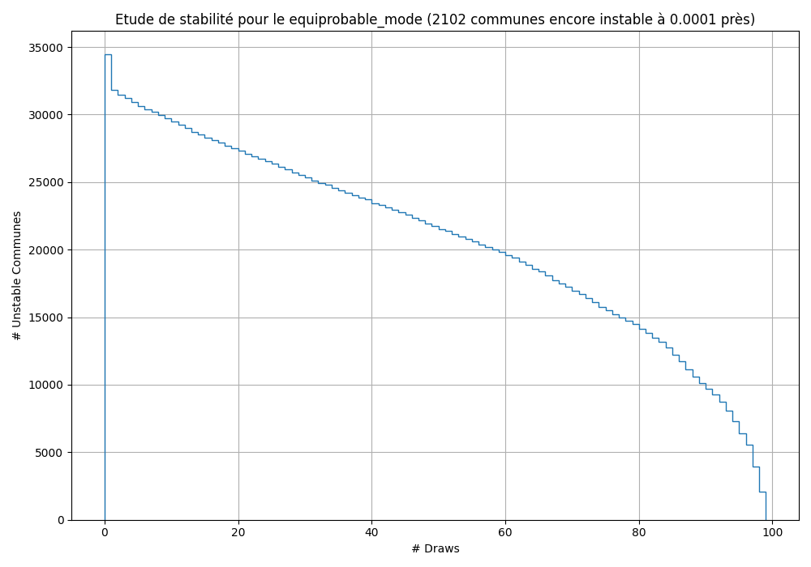

# Etude de stabilité de convergence

## Contexte
Cette étude s'intéresse au score de tourisme, qui veut quantifier l'importance de chaque commune pour les déplacements touristiques en véhicule électrique. On tire des trajet entre des communes ayant des véhicules électriques (au moins 5), et des villes ayant des points d'intérêts (au moins 2, au sens d'OpenStreet Map).
L'étude de stabilité de convergence essaie de quantifier la précision du score obtenu pour un certain nombre de tirage (environ 1M au moment de l'étude), pour un mode équiprobable et pour un mode weighted.  

## Modes de tirages
Le mode équiprobable tire de manière aléatoire les vills d'arrivée et de départ. Cela permet une pondération en aval, après avoir effectué tous les tirages. Le mode weighted pondère les tirage en amont, en même temps. Si cela permet une convergence plus rapide, une nouvelle pondération nécessite de recommencer tous les tirages.

## Résultats
On définit "stable" comme "non variable de plus que la tolérance par rapport au résultat final". Je n'ai pas mis de nombre minimum de step stabilisés, mais on peut aussi considérer qu'être stable à partir du step 97/100 est peut-être juste dû à la chance (voir la chute rapide sur la fin de certains graphes).

En choisissant une tolérance de 10^-4 sur le pourcentage de passages des tirages par la commune, on a un bonne stabilité pour le mode pondéré (weighted), mais pas encore pour le mode équiprobable, un peu comme attendu. A 10^-3 tout est considéré comme stable.

## Conclusion
On peut donc annoncer des scores de tourisme à 10^-3 sans problème quelque soit la méthode, même avec 1M de tirages "seulement".